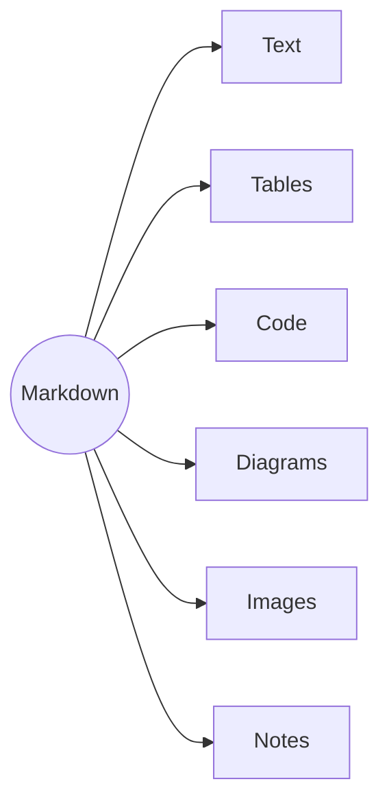

---
layout: Title
title: How tycoslide works
name: Create editable PowerPoint slides from markdown, using your existing .pptx templates.
jobTitle: ""
notes: |
  Five slides about tycoslide, built with tycoslide. Slide 3 is the markdown for slide 4.
---

---
layout: Timeline
title: How it works
milestone1_date: 1
milestone1_label: Create a theme
milestone1_body: Give an agent your .pptx. It maps the slides and shapes into a theme. Done once.
milestone2_date: 2
milestone2_label: Write markdown
milestone2_body: One file per deck, one slide per layout. Kept in Git.
milestone3_date: 3
milestone3_label: Build
milestone3_body: One command compiles the markdown into a .pptx on your template.
milestone4_date: 4
milestone4_label: Open in PowerPoint
milestone4_body: The output is a .pptx like any other.
---

---
layout: Code
title: "Example: the next slide, as markdown"
---

::code::

````md
---
layout: Image left
title: Markdown support
---

::body::

- Paragraphs, bullets and numbered lists
- Bold, italic and links
- Tables, in the template's table style
- Code, syntax-highlighted
- Mermaid diagrams, like the one on the left
- Images from the theme's catalog
- Speaker notes

::image::


````

---
layout: Image left
title: Markdown support
---

::body::

- Paragraphs, bullets and numbered lists
- Bold, italic and links
- Tables, in the template's table style
- Code, syntax-highlighted
- Mermaid diagrams, like the one on the left
- Images from the theme's catalog
- Speaker notes

::image::


---
layout: Closing
title: Try it
presenterName: npx skills add tycoworks/tycoslide
presenterTitle: github.com/tycoworks/tycoslide
---
